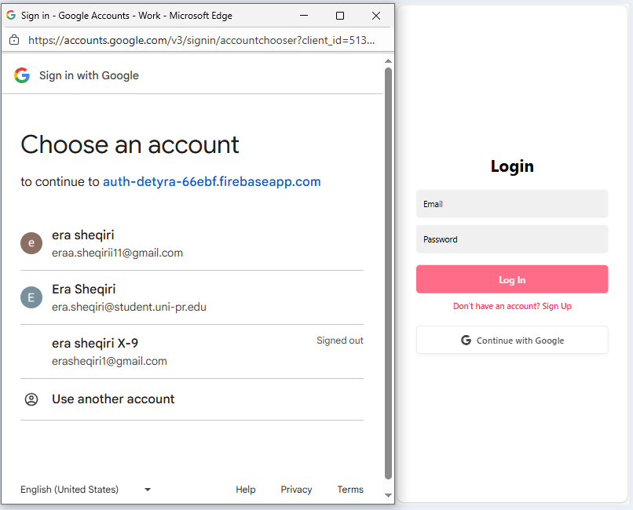
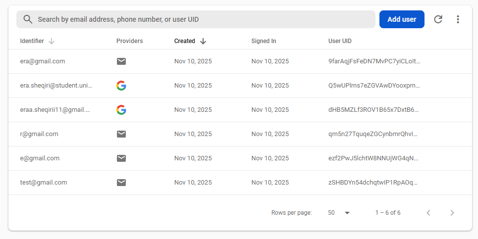

# Firebase Google Authentication (Expo Web) 
This project is a simple **React Native (Expo Web)** app built using **Firebase Authentication** for user signup and login.
The app supports:
- Sign up with **email & password**
- Login with **email & password**
- Login with **Google**
- A **Welcome page** that displays the logged-in user's name
----------------------------------------------------------------------------------------------------------------
## Screenshots

### Google Sign-In Screen


### Welcome Page


### Firbase User Console


-----------------------------------------------------------------------------------------------------------
## Features
-Firebase Authentication – Email/Password login & signup

-Google Sign-In – Available for Web only

-Session Handling – Auto redirect if user is not logged in

-User Interface – Clean design, error handling, and validation

-Navigation – Simple routing with expo-router

------------------------------------------------------------------------------------------------------------------
## Set up instuctions
### 1. Clone the repository
  ```bash
   https://github.com/erasheqiri1/Programimi_Pajisje_Mobile.git
   cd my-app
   ```
### 2. Install dependencies
   ```bash
   npm install
   ```
### 3. Create e firebase project
 - Go to [Firebase Console](https://console.firebase.google.com/)
 - Create a new Firebase project
 - Navigate to Authentiacation → Sign-in Method. Enable **Email/Password** and**Google Sign-In**
 - Go to Project Settings→General→Your app → Web App
 - Copy your Firebase Config
 - In your project, create a file name **firebaseConfig.js** and paste your config inside it

   ```bash
   import { initializeApp } from "firebase/app";
   import { getAuth } from "firebase/auth";
   
   const firebaseConfig = {
   apiKey: "YOUR_API_KEY",
   authDomain: "YOUR_AUTH_DOMAIN",
   projectId: "YOUR_PROJECT_ID",
   storageBucket: "YOUR_STORAGE_BUCKET",
   messagingSenderId: "YOUR_SENDER_ID",
   appId: "YOUR_APP_ID",
   };

   const app = initializeApp(firebaseConfig);
   export const auth = getAuth(app);
   export default app;
   ```

----------------------------------------------------------------------------------------------------------------
## Folder Structure

 ```bash
MY-APP/
├── app/
│   ├── (auth)/
│   │   ├── login.jsx
│   │   ├── signup.jsx
│   │   └── welcome.jsx
│   ├── _layout.jsx        
│   └── index.jsx
│
├── firebaseConfig.jsx
└── README.md


   ```

